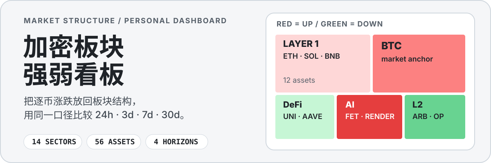
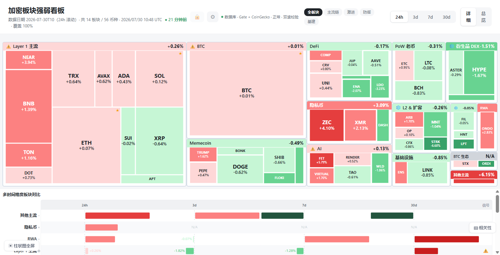
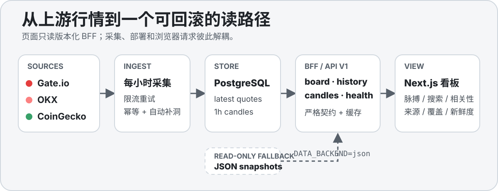

<p align="center">
  
</p>

<p align="center">
  <a href="https://crypto-sector-board.vercel.app"></a>
  <a href="https://github.com/sitabanubanu/crypto-sector-board/actions/workflows/quality.yml"></a>
  
  
</p>

<p align="center">
  <a href="https://crypto-sector-board.vercel.app"><strong>打开在线看板</strong></a>
  ·
  <a href="https://github.com/sitabanubanu/crypto-sector-board#本地运行">本地运行</a>
  ·
  <a href="./docs/06-runbook.md">运维手册</a>
</p>

这是一个面向个人观察的加密市场结构看板。它把 **56 个资产**归入
**14 个板块**，用 Treemap、市场广度、排名变化和同口径历史数据比较
**24h / 3d / 7d / 30d** 强弱。面积代表市值权重，颜色代表涨跌：
**红涨、绿跌**。

<p align="center">
  <a href="https://crypto-sector-board.vercel.app">
    
  </a>
</p>

<p align="center"><sub>Production 实景；行情和排序会随数据刷新变化。</sub></p>

## 一眼看到什么

- **市场结构**：Treemap 同时展示板块和币种，避免在零散涨跌榜里来回切换。
- **市场脉搏**：汇总全市场上涨广度、板块排名变化、主要贡献者和数据质量。
- **可解释信号**：轮动与异动信号包含规则版本、触发原因、样本数和数据时间。
- **周期分歧**：24h、3d、7d、30d 并排，缺失历史明确显示为 `N/A`。
- **快速定位**：首页可按资产 ID、代码、名称或板块搜索，并联动高亮两张主图。
- **数据可信度**：页面显示 backend、source、freshness、coverage 和 fallback。
- **继续下钻**：点击币种查看价格、市值、成交活跃度和历史；自选板块保存在本地浏览器。

当前主路径已经从“浏览器逐币请求 + Git 快照”切换为
“PostgreSQL + server-only DAL + 版本化 BFF”。浏览器不会直接访问交易所，
每小时采集也不会再提交 JSON 或触发一次网站部署。

## 当前状态与边界

已完成的 P0～P4，以及 P5.0 / P5.1：

- 安全边界、依赖审计和自动质量门。
- 56 资产 / 168 provider 状态的规范注册表。
- PostgreSQL migration、seed、幂等采集、重试和自动补洞。
- `/api/v1/board`、`candles`、批量 `history` 和 `data-health`。
- DB/JSON 双读比较，以及 `DATA_BACKEND=json` 只读回滚路径。
- 关注资产语义、按 UTC 日期对齐的相关性、样本质量门和 `N/A` 降级。
- 市场广度、中位数、贡献者、排名变化、可解释信号与首页搜索高亮。
- Production 与每小时数据库采集已经上线。

> [!WARNING]
> 这是数据可视化与工程实验项目，不构成投资建议。金色星标仅表示“关注资产”，
> 不代表真实持仓。信号和相关性仍是观察指标，不表示因果关系；回测尚未实现。

当前已知边界：

- Preview 与 Production 暂时共用同一套 Neon Free 数据库，只适合当前个人、低流量使用。
- MKR、XMR 没有可用的 Gate/OKX 现货历史，相应历史必须保持缺失，不能用其他资产代替。
- 移动端基础布局和窄屏柱状图已可用，但专用列表视图与更完整的触控体验仍留在 P6。
- Telegram 推送脚本仍在仓库中，但没有接入当前每小时采集 workflow。

## 数据路径

<p align="center">
  
</p>

1. Gate.io 和 OKX 提供 quote 与 `1h` K 线；CoinGecko 补充市值和末端 quote。
2. GitHub Actions 每小时运行，处理限流重试、幂等写入和游标补洞。
3. PostgreSQL 保存 latest quotes、小时 K 线、运行记录和资产注册表。
4. Next.js 通过窄 BFF 返回 board、candles、history 和健康状态。
5. 数据库读路径异常时，可以切到只读 JSON；回滚读取不会删除数据库数据。

## 接口

| Endpoint | 用途 | 缓存 |
|---|---|---:|
| `GET /api/v1/board` | 当前板块、资产、来源和覆盖率 | 30 秒 |
| `GET /api/v1/candles?assetId=bitcoin&limit=48` | 单资产 `1h` K 线 | 5 分钟 |
| `GET /api/v1/history?assetIds=bitcoin,ethereum&days=31` | 多资产批量日级历史 | 5 分钟 |
| `GET /api/v1/data-health` | provider、K 线、quote 和运行健康 | 不缓存 |

错误查询返回窄错误对象；内部异常不会向客户端暴露连接串或上游凭据。

## 本地运行

最快路径不要求数据库：缺少数据库连接时，页面自动使用仓库中的只读 JSON。

```bash
git clone https://github.com/sitabanubanu/crypto-sector-board.git
cd crypto-sector-board
npm install
npm run dev
```

打开 `http://localhost:3000`。

要使用完整数据库路径，复制 `.env.example` 为 `.env.local`，填写隔离的
`DATABASE_URL`，然后运行：

```bash
npm run db:setup
npm run ingest-market-data
npm run data:health
```

### 质量门

```bash
npm run check
```

`check` 会依次执行 ESLint、TypeScript、资产注册表、migration 校验、Vitest、
生产依赖审计、完整审计策略和 Next.js production build。

<details>
<summary><strong>主要环境变量</strong></summary>

| 变量 | 作用 |
|---|---|
| `DATABASE_URL` | 服务端 PostgreSQL pooled connection string |
| `DATABASE_POOL_MAX` | serverless 单进程连接上限，默认 `1` |
| `DATA_BACKEND` | `db` 主路径或 `json` 回滚路径 |
| `DATA_DUAL_READ` | DB 模式下是否比较最后一份有效 JSON |
| `COINGECKO_API_KEY` | 可选 CoinGecko Pro key，只能放在服务端 |
| `INGEST_INITIAL_BACKFILL_HOURS` | 首次采集窗口 |
| `INGEST_REPAIR_LOOKBACK_HOURS` | 内部缺口检查窗口 |
| `INGEST_MAX_BACKFILL_HOURS` | 单次自动补洞上限 |
| `INGEST_HISTORY_BACKFILL_HOURS` | 一次性深历史补齐；不得写入定时 workflow |

完整示例见 [`.env.example`](./.env.example)。

</details>

<details>
<summary><strong>项目结构</strong></summary>

```text
app/api/v1/          board / candles / history / data-health
components/          Treemap、趋势图、详情和实验功能
data/                资产注册表、板块配置和只读快照
drizzle/             PostgreSQL migrations
lib/db/              schema、连接、seed 和查询
lib/ingestion/       provider adapter、补洞、重试、健康报告
lib/market-data/     数据契约、标准化、聚合和双读比较
lib/server/          server-only DAL、缓存和后端切换
scripts/             DB、采集、健康与映射命令
tests/               契约、路由、指标、数据库和采集测试
.github/workflows/   quality、每小时采集、每日健康检查
```

</details>

## 部署

- **代码发布**：当前项目没有启用 Vercel Git 自动部署。先通过质量门并推送已确认的提交，
  再手动运行 GitHub Actions 的 `Deploy Production`；本地有 Vercel 登录态时也可执行
  `npx vercel deploy --prod --yes`。
- **数据刷新**：`.github/workflows/ingest.yml` 每小时只写 PostgreSQL，不提交数据文件。
- **数据巡检**：`.github/workflows/data-health.yml` 每日检查覆盖率、新鲜度和失败运行。

Production：[crypto-sector-board.vercel.app](https://crypto-sector-board.vercel.app)

## 路线图

- [x] **P0** — 安全边界、依赖审计、质量门
- [x] **P1** — 数据契约、指标语义、provider fixtures
- [x] **P2** — PostgreSQL 与规范资产注册表
- [x] **P3** — 幂等采集、自动补洞、数据健康
- [x] **P4** — BFF、数据库页面读路径、DB/JSON 回滚
- [ ] **P5** — P5.0/P5.1 已完成；真实持仓盈亏和无前视回测待后续阶段
- [ ] **P6** — 移动体验、无障碍、管理端和独立 Production 数据库

完整进度见 [`PROJECT_STATUS.md`](./PROJECT_STATUS.md) 和
[`docs/07-complete-repair-plan.md`](./docs/07-complete-repair-plan.md)。

## 文档

- [架构](./docs/02-architecture.md)
- [数据口径](./docs/03-data-spec.md)
- [运维与回滚](./docs/06-runbook.md)
- [P2 数据库与注册表](./docs/09-p2-database-and-asset-registry.md)
- [P3 可靠采集](./docs/10-p3-reliable-ingestion.md)
- [P4 BFF 与页面切换](./docs/11-p4-bff-and-page-cutover.md)
- [P5.0/P5.1 市场脉搏实施计划](./docs/12-p5-market-pulse.md)

## 许可证

当前仓库尚未包含独立 `LICENSE` 文件。仓库公开可读不等于已经授予复用许可；
对外授权前需要补充明确的开源许可证。
