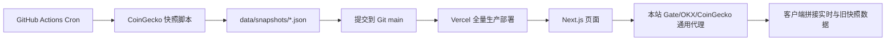
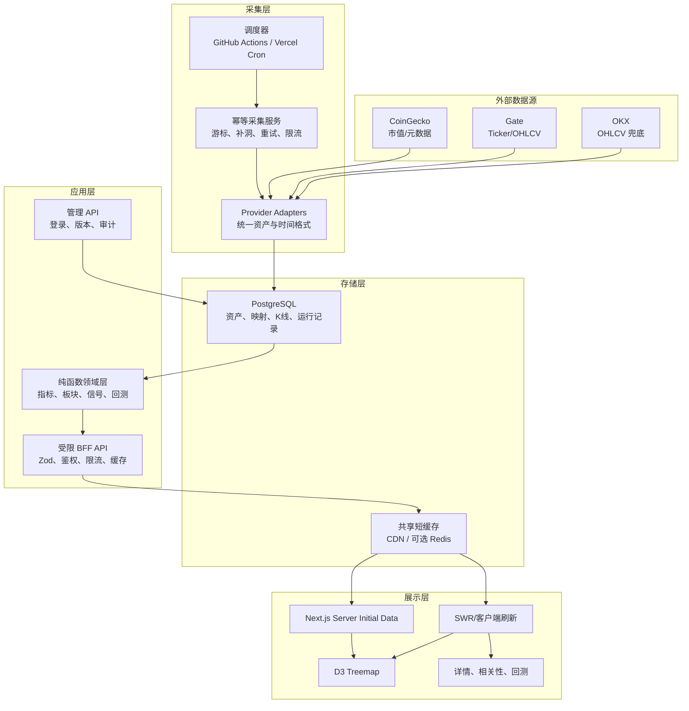

# 07 — 加密板块情绪看板完整修复与演进方案

> 版本：1.0
> 制定日期：2026-07-29
> 适用项目：`sitabanubanu/crypto-sector-board`
> 当前代码基线：`56a965a`
> 文档性质：实施总纲，不包含本轮代码修改
> 调研方式：当前项目完整只读审查 + GitHub 同类项目固定 commit 源码取证

---

## 1. 执行摘要

这个项目不需要推倒重写。应当保留已经形成辨识度的板块 Treemap、中文信息架构、14 个板块定义、56 个币种范围和 Vercel 前端部署方式；需要替换的是数据与计算底座。

最终建议不是搬用某一个开源项目，而是组合以下成熟模式：

1. 用 CCXT/Hummingbot 的“统一资产标识 + 交易所适配器”思路管理 Gate、OKX、CoinGecko。
2. 用 Ghostfolio 的“行情持久化、唯一键、事务和真实持仓模型”思路替换 Git 快照。
3. 用 OpenStatus 的“认证 Cron → 任务拆分 → 重试 → 运行记录”思路重做数据采集。
4. 用 Freqtrade 的“固定 timeframe、缺口处理、手续费、反未来数据检查”思路重做回测。
5. 用 Vercel Cron 示例理解部署入口，但不能照搬它的最小实现作为生产架构。
6. 可选使用 Lightweight Charts 重做币种详情 K 线，Treemap 继续保留 D3。

目标架构仍然是一个 Next.js 项目，但数据不再写进 Git，也不再每抓一次行情就重新部署。

### 1.1 最终技术决策

| 决策项 | 默认方案 | 原因 |
|---|---|---|
| 前端与 BFF | Next.js + Vercel | 保留现有投入，避免重写 |
| 主数据库 | 标准 PostgreSQL，默认 Neon | 56 币小时数据规模不需要专用时序数据库 |
| ORM | Drizzle | TypeScript 友好、轻量、适合 serverless |
| 实时 ticker | 受限的本站聚合 API，20～30 秒共享缓存 | 不暴露通用代理，避免每位访问者分别轰炸交易所 |
| 历史 K 线 | Gate 主源、OKX 兜底、CoinGecko 仅补充市值/元数据 | 职责清晰，避免把四个不等距点当日线 |
| 调度 | 当前 Hobby 阶段继续 GitHub Actions，但改成可追赶的 DB 入库任务 | GitHub Cron 会漏跑，但“按游标补齐”可以恢复缺口 |
| Vercel Pro 后 | 可迁移到 Vercel Cron，仍复用同一个幂等采集服务 | 调度器可替换，业务逻辑不绑定 |
| 部署 | 代码 push 触发部署；数据采集不再触发部署 | 将发布和数据更新彻底解耦 |
| 管理端认证 | Auth.js + GitHub 登录白名单 | 不再使用公开 POST 或浏览器内 PAT |
| 测试 | Vitest + Playwright + provider fixtures | 先固定数据口径，再继续增加功能 |

### 1.2 不建议做的事

- 不要把 Freqtrade、Ghostfolio、OpenStatus 整体引入项目。
- 不要在 Vercel Serverless Function 里维护长期 WebSocket。
- 不要继续把每小时 JSON 提交到 Git。
- 不要把免费 GitHub Actions Cron 当成严格小时调度器。
- 不要把缺失数据转换成 `0`。
- 不要把成交量热度命名为“资金流入”。
- 不要在数据时间轴修好以前继续扩展回测、轮动信号和相关性。
- 不要清洗或重写现有 Git 历史；先停止新增快照提交即可。

---

## 2. 项目保留契约

后续修复必须保留项目的“灵魂”，避免为了架构整洁把产品做成另一个普通行情站。

### 2.1 必须保留

- 核心价值：一眼看清加密板块相对强弱，而不是提供交易下单。
- 核心视觉：Treemap 板块地图和红涨绿跌的中文市场语境。
- 领域语言：板块、强弱、轮动、趋势、异动、自选、相关性。
- 使用方式：公开看板无需登录；只有管理功能需要登录。
- 部署体验：前端继续托管在 Vercel，代码继续开源在 GitHub。
- 渐进迁移：旧 JSON 数据源在新系统验证完成前可作为回滚路径。

### 2.2 明确非目标

- 不做交易执行、API 下单和用户资金托管。
- 不做高频交易系统。
- 第一阶段不做 Twitter、Reddit 等社交情绪抓取。
- 第一阶段不引入 Kafka、Kubernetes、QuestDB 或完整微服务体系。
- 不把网站变成 Ghostfolio 式全功能财富管理平台。
- 不承诺“预测涨跌”；信号只描述已发生的市场状态。

---

## 3. 当前基线与已确认问题

### 3.1 当前真实数据链路



这条链路同时承担采集、存储、发布和运行时聚合，导致任何一层出问题都会污染“刚更新”、历史回测和线上部署。

### 3.2 已量化的基线

| 指标 | 当前值 |
|---|---:|
| 板块数 | 14 |
| 币种数 | 56 |
| 能按现有映射取得 Gate 实时数据 | 约 51 |
| 线上快照总数 | 498 |
| 小时快照数 | 497 |
| 理论小时槽位 | 1,791 |
| 小时覆盖率 | 27.7% |
| 超过 2 小时的缺口 | 272 |
| 最大缺口 | 21 小时 |
| ESLint | 3 errors / 10 warnings |
| 依赖审计 | 6 high / 2 low |
| 自动测试 | 0 |

### 3.3 当前最高风险

1. `/api/sectors` POST 没有鉴权，配置 GitHub Token 后可直接修改主分支。
2. Gate、OKX、CoinGecko 是带 `CORS: *` 的通用代理。
3. `/api/snapshots?date=` 存在潜在目录穿越。
4. 回测把不规则小时快照当成日数据，并重复复利滚动 24h 收益。
5. “持仓总市值”实际上是所选币种全网市值之和。
6. 自选板块切换会丢失 `customSectors`。
7. 板块管理器把 Gate 交易对 ID 写进要求 CoinGecko ID 的配置。
8. 页面“刚更新”只说明 Gate ticker 新，不说明其他字段新。
9. CoinGecko Pro 域名和工作流密钥传递都不正确。
10. 文档描述已经明显落后于代码。

---

## 4. 目标架构



### 4.1 分层职责

| 层 | 只负责什么 | 不再负责什么 |
|---|---|---|
| Provider Adapter | 调上游、限流、超时、解析、标准化 | 板块计算、UI 字段 |
| Ingestion Service | 追赶缺失时间段、幂等写入、记录运行状态 | 部署 Vercel |
| PostgreSQL | 保存规范化数据和配置版本 | 充当构建产物 |
| Domain | 纯函数计算指标、信号、回测 | 发网络请求 |
| BFF API | 参数校验、聚合、鉴权、限流、缓存 | 转发任意路径 |
| UI | 展示、交互、局部刷新 | 自行拼接多个不一致数据源 |

---

## 5. 统一数据规范

### 5.1 资产标识

系统内部必须只认一个稳定的 `asset_id`，例如：

```text
asset_id: bitcoin
symbol: BTC
providers:
  coingecko: bitcoin
  gate: BTC_USDT
  okx: BTC-USDT
```

不能继续让 CoinGecko ID、Gate pair 和 OKX instId 混在同一个 `coins: string[]` 字段里。

每个映射需要保存：

- `asset_id`
- `provider`
- `provider_instrument_id`
- `base_symbol`
- `quote_symbol`
- `status`
- `first_seen_at`
- `last_verified_at`
- `delisted_at`
- `priority`
- `mapping_note`

映射巡检任务每天运行一次，自动发现：

- 配置中存在但交易所已经下架的交易对。
- 交易所有同名新交易对但尚未建立映射。
- 币种改名、迁移或 CoinGecko ID 变化。
- 多个资产争用同一 ticker 的歧义。

### 5.2 推荐数据库表

| 表 | 作用 | 关键约束 |
|---|---|---|
| `assets` | 规范币种主表 | `asset_id` 唯一 |
| `provider_instruments` | 各数据源映射与能力 | `(provider, instrument_id)` 唯一 |
| `market_quotes_latest` | 最新 ticker | `(asset_id, provider)` 唯一 |
| `market_candles` | 完整 OHLCV | `(asset_id, provider, timeframe, open_time)` 唯一 |
| `market_caps` | 市值与供应量时间序列 | `(asset_id, provider, observed_at)` 唯一 |
| `ingestion_runs` | 每次采集运行记录 | `dedupe_key` 唯一 |
| `sectors` | 板块定义 | `sector_id` 唯一 |
| `sector_memberships` | 带有效期的板块成员 | 允许 point-in-time 回测 |
| `sector_metric_snapshots` | 可选的板块聚合缓存 | `(sector_id, interval, as_of)` 唯一 |
| `portfolio_positions` | 用户真实持仓 | 数量、成本、币种、费用 |
| `strategy_versions` | 回测策略版本 | 配置 hash 唯一 |
| `backtest_runs` | 回测输入、状态和结果 | 可重现、可审计 |

### 5.3 时间规范

所有数据库时间使用 UTC：

- `observed_at`：上游数据代表的市场时间。
- `fetched_at`：本系统收到数据的时间。
- `open_time`：K 线起始时间。
- `close_time`：K 线结束时间。
- `is_complete`：该根 K 线是否闭合。
- `as_of`：某次指标计算实际使用的数据截止时间。

前端只在显示层转换为用户时区。

### 5.4 缺失数据规则

- 缺失值必须是 `null`，不能自动变成 `0`。
- 不允许用 `high × 0.99` 伪造开盘价。
- 不允许把 4 个不等距点伪装成 30 根日线。
- 兜底源的数据必须带 `fallback_used: true`。
- 板块指标必须返回 `coverage_ratio`。
- `coverage_ratio < 0.8` 时默认显示 `N/A`，不能显示 `+0.00%`。
- 历史补洞数据必须记录来源和补洞时间。
- 无法补回的旧缺口保留为缺口，不能线性插值后用于回测。

### 5.5 指标定义

| 指标 | 正确定义 |
|---|---|
| `return_24h_rolling` | 当前有效价格 / 24 小时前价格 - 1 |
| `return_1d_utc` | 当日 UTC 已闭合/当前中的 K 线口径，名称必须说明 |
| `return_3d/7d/30d` | 统一 timeframe 下按时间戳寻找基准点 |
| `amplitude` | `high / low - 1` |
| `volatility` | 固定样本频率的 log return 标准差 |
| `sector_return` | 明确记录权重类型、覆盖率、权重时间点 |
| `volume_share` | 板块成交量 / 全部追踪板块成交量 |
| `market_activity` | 成交量和波动活跃度，不命名为资金流 |

板块权重建议同时保留三种：

1. `market_cap_weighted`
2. `equal_weighted`
3. `volume_weighted`

默认看板继续使用市值加权，但 UI 必须明确写出加权方式。

---

## 6. 数据采集与调度方案

### 6.1 当前阶段：GitHub Actions 只做触发，不做存储和部署

新的数据工作流应当：

```text
npm ci
→ npm run ingest-market-data
→ 读取数据库中每个 provider/timeframe 的最后游标
→ 请求游标之后所有已闭合 K 线
→ 标准化和校验
→ 幂等 upsert
→ 写 ingestion_runs
→ 输出质量摘要
```

必须删除以下行为：

- `git add data/snapshots`
- 自动提交 JSON
- `git push`
- 每次采集执行 `vercel deploy --prod`

即使 GitHub Actions 漏跑 10 小时，下一次任务也会从数据库游标开始补回这 10 根小时 K 线。调度不再需要“恰好准点”，只需要最终会再次运行。

### 6.2 Vercel Cron 的使用边界

Vercel 官方文档说明：

- Cron endpoint 应使用 `CRON_SECRET`。
- Vercel 失败后不会自动重试。
- 事件可能重复投递，需要幂等。
- 任务可能重叠，需要锁。
- Hobby 当前只能每天运行一次；高频 Cron 需要合适的付费计划。

因此：

- Hobby 阶段默认继续用 GitHub Actions + 补洞。
- 升级 Vercel 计划后，可以把调度入口换成 Vercel Cron。
- 采集逻辑必须是独立 service，不能写死在 Route Handler 中。
- 如果未来需要 1～5 分钟频率，使用队列/独立 worker，而不是把所有工作塞进一次 serverless 请求。

参考：[Vercel Cron 管理与可靠性说明](https://vercel.com/docs/cron-jobs/manage-cron-jobs)

### 6.3 幂等、锁和重试

每次任务生成：

```text
dedupe_key = provider + timeframe + scheduled_bucket
```

数据库中：

- `dedupe_key` 唯一。
- 同一数据唯一键 upsert。
- 开始前获取 PostgreSQL advisory lock 或唯一运行锁。
- 上游 429、5xx、网络错误使用指数退避。
- 解析错误不重试无限次，记录原始响应摘要和失败资产。
- 一个币失败不能使其他 55 个币的结果全部丢失。
- 最终状态区分 `success`、`partial`、`failed`、`skipped_duplicate`。

### 6.4 数据频率

第一版建议：

| 数据 | 频率 |
|---|---|
| 最新 ticker | 页面共享缓存 20～30 秒 |
| 1h OHLCV | 每小时采集并自动补洞 |
| 市值/供应量 | 每小时或每 4 小时 |
| 资产映射巡检 | 每天 |
| 板块指标预计算 | 每小时数据写入后 |
| 数据质量报告 | 每天 |

56 个币每小时一年约 49 万根 K 线/数据源，普通 PostgreSQL 足够。只有进入多交易所、1 分钟长期历史后，才评估 TimescaleDB、Tinybird 或 QuestDB。

---

## 7. API 重构方案

### 7.1 删除通用代理

以下模式必须退出：

```text
/api/gate/[...path]
/api/okx/[...path]
/api/cg/[...path]
```

改为固定用途接口：

```text
GET /api/v1/board?period=24h&weight=market_cap
GET /api/v1/assets/:assetId
GET /api/v1/assets/:assetId/candles?timeframe=1h&from=&to=
GET /api/v1/sectors/:sectorId/history?timeframe=1h&from=&to=
GET /api/v1/data-health
POST /api/v1/backtests
GET /api/v1/backtests/:runId
GET /api/admin/sectors
PUT /api/admin/sectors/:sectorId
POST /api/internal/ingest
```

上游请求只存在于 `server-only` provider adapter 中。

### 7.2 每个接口的共同约束

- Zod 校验 path、query 和 body。
- 日期使用严格 ISO 8601，限制最大查询区间。
- 分页和最大返回点数。
- 超时和 AbortSignal。
- 明确缓存策略。
- 返回统一错误码，不透传上游完整错误。
- 不返回上游 Key、URL 参数或内部堆栈。
- 管理接口必须验证服务端 session。
- 内部采集接口必须验证 `Bearer` token。
- 对公开接口增加 IP/令牌桶限流；初期可用 Upstash Redis，也可先采用 Vercel 防护和较严格缓存。

### 7.3 统一响应元数据

```json
{
  "data": {},
  "meta": {
    "asOf": "2026-07-29T06:00:00Z",
    "generatedAt": "2026-07-29T06:00:03Z",
    "sources": ["gate", "coingecko"],
    "fallbackAssets": ["monero"],
    "coverageRatio": 0.9821,
    "isStale": false,
    "staleAfterSeconds": 120
  }
}
```

页面“刚更新”必须来自 `meta`，不能再只看一次 Gate 请求完成时间。

---

## 8. 安全修复方案

### 8.1 P0 立即处理

1. 生产环境暂时禁用 `/api/sectors` POST，返回 405。
2. 删除或封闭三个通用代理。
3. `snapshots?date=` 只允许严格文件名格式，随后在数据库迁移后删除该读文件接口。
4. CoinGecko Key 只在服务端使用；Pro Key 切换到 Pro base URL。
5. 所有请求增加超时、最大响应大小和 allowlist。
6. Next.js、undici 和高危传递依赖升级到审计通过版本。
7. 修复 hydration mismatch、ESLint errors，并让 CI 阻止带错误的合并。

### 8.2 管理端

推荐 Auth.js + GitHub OAuth：

- 只允许配置中的 GitHub login。
- session 只在服务端判断。
- 板块修改写数据库，不写 GitHub 主分支。
- 保存 `created_by`、`updated_by`、`version`、`updated_at`。
- 修改前预览 diff。
- 删除需要二次确认。
- 保留版本回滚。

在认证完成前，宁可只允许通过 Pull Request 改 `sectors.json`，也不要保留匿名管理 API。

### 8.3 Secret 管理

- `DATABASE_URL`、API Key、OAuth Secret、`CRON_SECRET` 只放 Vercel/GitHub Secrets。
- GitHub PAT 使用最小权限，不授予 `delete_repo`。
- 日志不得打印带认证信息的代理 URL。
- `.env*` 继续禁止提交。
- `.vercel/project.json` 不是密钥，但公开仓库没有必要依赖个人/团队 ID；后续 CI 可显式 link 或使用项目级变量。

---

## 9. 各功能的具体修理方案

### 9.1 主看板

现状问题：

- 实时 price 与旧 market cap 混用。
- 缺失周期显示为 `0`。
- 面积公式与文档不同。
- 小板块可能因阈值显示 `+0.00%`。

修复：

- 页面只消费 `/api/v1/board` 的统一响应。
- 统一以 `asOf` 计算全部币和板块。
- 明确 Treemap 面积公式，并写进测试。
- 缺失显示 `N/A` 和覆盖率。
- tooltip 显示数据源、时间和兜底状态。
- “开盘/收盘”只用于真实 OHLC，不再展示反推价格。

验收：

- 同一时间点的 API fixture 可以稳定生成相同布局输入。
- 0% 真实涨跌仍显示 0%，不会伪造正收益。
- `coverage_ratio < 0.8` 的板块不会显示确定性涨跌。

### 9.2 自选和自定义板块

修复：

- `toggleSector` 必须保留完整 config。
- `editingId` 使用明确状态：`undefined=closed`、`null=creating`、`string=editing`。
- reducer 或不可变更新函数统一管理操作。
- localStorage 增加 schema version 和迁移函数。
- reset 删除自定义板块前二次确认。
- 自定义币种使用内部 `asset_id`。

测试：

- 切换内置板块不会丢自定义板块。
- 创建、编辑、取消、删除、reset 都有单测。
- 旧 localStorage 配置可迁移。

### 9.3 全局板块管理

修复：

- 下拉框返回 `asset_id`，展示 provider symbols 作为辅助信息。
- 保存前验证资产存在、没有重复、板块 ID 合法。
- 写数据库的版本化配置。
- 管理页面加载时显式初始化，不依赖 mouseenter。
- 保存后重新拉取并核对 version。

验收：

- 不可能把 `BTC_USDT` 写进 `asset_id` 字段。
- 未登录请求为 401/403。
- 并发修改返回版本冲突，不静默覆盖。

### 9.4 持仓

现有 holdings 只能保留为“关注币种”，不能称为真实持仓。

真实持仓至少需要：

- `asset_id`
- `quantity`
- `average_cost`
- `cost_currency`
- `fees`
- `opened_at`
- 可选账户/钱包

第一版只实现：

- 当前估值
- 成本
- 未实现盈亏
- 24h 估算变动
- 资产权重

复杂的 TWR/MWR、税务和链上钱包同步不在第一版。

### 9.5 信号

信号统一放到一个纯函数模块，UI 和 Telegram 共享：

- 输入必须包含所需周期和质量信息。
- 缺失周期返回 `insufficient_data`。
- 信号输出包含规则版本、触发原因和 `asOf`。
- “轮动”必须基于板块排名变化，而不是简单正负号。
- “异动”使用历史均值和标准差，并设最小样本量。
- “资金流”改名为“成交活跃度”，除非以后接入真实资金流数据。

### 9.6 相关性

- 先按 timestamp 做 inner/controlled join。
- 使用统一、非重叠收益频率。
- 默认至少 30 个有效观察值。
- 返回共同样本数。
- 板块收益权重和主看板一致。
- 对高相关性的解释改为“历史共同波动”，不暗示因果。

### 9.7 回测

回测必须重做，旧结果不应继续展示为可信结果。

正确流程：

```text
固定策略版本
→ 固定资产与板块 point-in-time 成员
→ 加载统一 timeframe 的完整 candles
→ 明确缺口策略
→ 只用当时已知数据产生信号
→ 下一可交易时点执行
→ 扣手续费和滑点
→ 与同频 BTC benchmark 比较
→ 保存输入 hash、结果和质量摘要
```

最低要求：

- 固定 `timeframe`、`from`、`to`。
- 不使用重叠滚动收益连续复利。
- 不允许未来数据和当前板块成员回填历史。
- 月收益使用复利，不相加。
- 显示样本数、缺口率、换手率、费用。
- 输入配置与策略代码生成 hash，结果可复现。
- 回测在服务端一次读取数据，不让浏览器发 498 个请求。

第一版验收策略：

- 简单的“每周按 7d 板块收益 Top N 调仓”。
- 信号在周末闭合后生成，下一个周期开始时成交。
- 费用、滑点可配置。
- 单元 fixture 可以手算出预期结果。

### 9.8 图表、移动端与无障碍

- Treemap 继续用 D3。
- 币种详情可选 Lightweight Charts，要求数据按时间升序且无重复。
- 移动端增加真正的列表视图，不缩小桌面 Treemap 代替。
- SVG 可点击元素增加 keyboard handler、role、tabIndex 和可读 label。
- 所有图标按钮增加 `aria-label`。
- 颜色之外再使用符号/文字表达涨跌和缺失。
- tooltip 在触摸屏可点击固定和关闭。

---

## 10. 前端代码组织

建议从目前过大的 `HomeClient.tsx` 中拆出：

```text
app/
  api/v1/
  api/admin/
  api/internal/

components/
  board/
  charts/
  portfolio/
  signals/
  watchlist/

lib/
  market-data/
    contracts.ts
    registry.ts
    providers/
      gate.ts
      okx.ts
      coingecko.ts
    normalize.ts
    quality.ts
  domain/
    metrics.ts
    sectors.ts
    signals.ts
    correlation.ts
    backtest.ts
  db/
    schema.ts
    client.ts
    queries/
  auth/
  validation/

scripts/
  ingest-market-data.ts
  import-legacy-snapshots.ts
  verify-provider-mappings.ts
```

约束：

- `domain/` 不允许 `fetch`。
- `providers/` 不允许引用 React。
- components 不直接请求交易所。
- API 返回类型从 Zod schema 推导。
- 所有 provider 原始响应用 fixture 固定。

---

## 11. 测试和质量门

### 11.1 单元测试

必须覆盖：

- 固定周期收益、振幅、波动率。
- 市值/等权/成交量权重。
- 缺失值和覆盖率。
- Gate/OKX/CoinGecko normalize。
- 资产映射和别名。
- watchlist reducer。
- 信号规则。
- timestamp 对齐和相关性。
- 回测手续费、滑点、复利、调仓时点。

### 11.2 Provider Contract Test

每个数据源保存脱敏 fixture：

```text
tests/fixtures/gate/tickers.json
tests/fixtures/gate/candles.json
tests/fixtures/okx/candles.json
tests/fixtures/coingecko/markets.json
```

测试上游字段变化时：

- schema 是否拒绝。
- 是否标记 partial。
- 是否安全降级。
- 是否不会产生 0 值假数据。

### 11.3 数据库集成测试

- 相同任务运行两次不增加重复数据。
- 同一 candle 更新可安全 upsert。
- 事务失败不会先删掉旧历史。
- 缺 10 个小时后再次运行能补齐。
- 并发运行只有一个获得锁。
- 板块成员版本可重建历史状态。

### 11.4 E2E

Playwright 覆盖：

- 首页加载和 period 切换。
- 数据过期/部分缺失状态。
- 自选创建、编辑和保留。
- 管理端未登录拒绝。
- 移动端列表视图。
- 键盘操作 Treemap。
- 回测提交、等待和结果页面。

### 11.5 CI

每个 Pull Request 必须通过：

```text
npm ci
npm run lint
npm run typecheck
npm run test
npm run test:integration
npm run build
```

生产部署前增加：

- 依赖安全审计。
- 数据库 migration dry-run。
- API contract compatibility。
- Playwright smoke test。

---

## 12. 可观测性和数据 SLO

### 12.1 建议 SLO

| 指标 | 目标 |
|---|---:|
| 小时 K 线 24h 内最终覆盖率 | ≥ 99.5% |
| 最新 ticker 正常时延 | ≤ 90 秒 |
| 映射成功率 | ≥ 98%，其余明确显示 fallback |
| API 5xx | < 0.5% |
| 板块计算覆盖率 | 页面可见且可解释 |
| 数据采集失败恢复 | 下一次运行自动补洞 |

### 12.2 数据健康页面

`/api/v1/data-health` 和管理 UI 显示：

- 每个 provider 最后成功时间。
- 最近 24h/7d 缺口。
- 失败币种。
- 429/5xx 次数。
- 当前 fallback 币种。
- stale 资产数。
- 映射过期数。
- 最近 ingestion run。

### 12.3 告警

先使用 GitHub Actions summary + Telegram：

- 运行完全失败。
- 连续两次 partial/failed。
- 小时覆盖率低于 95%。
- 某资产超过 6 小时无有效数据。
- provider schema 解析失败。
- 映射巡检发现 symbol 变化。

Telegram 消息应复用同一个 signal/quality 模块，不能维护第二套逻辑。

---

## 13. 部署与分支策略

### 13.1 只保留一种生产部署触发

两种方式选择其一：

1. 推荐：Vercel Git Integration 监听 `main`。
2. 备选：单独的 `deploy.yml` 在 `push main` 后执行 Vercel CLI。

不能同时启用，避免双重部署。

### 13.2 数据工作流与发布工作流分离

```text
pull_request.yml
  lint / typecheck / test / build

deploy.yml
  仅代码 main 更新时部署

ingest.yml
  schedule + workflow_dispatch
  只写数据库

data-health.yml
  每日质量报告和补洞
```

### 13.3 环境

| 环境 | 数据库 | 用途 |
|---|---|---|
| Local | 本地 Postgres/测试容器或隔离开发库 | 开发 |
| Preview | 数据库 preview branch/只读样本 | PR 验收 |
| Production | 生产 Postgres | 线上 |

Vercel 目前通过 Marketplace 接入 Neon、Supabase 等 PostgreSQL 服务，并自动注入环境变量。默认建议 Neon，但数据库层保持标准 PostgreSQL，不绑定专有能力。

参考：[Vercel Marketplace Storage](https://vercel.com/docs/marketplace-storage)

---

## 14. 旧数据迁移

### 14.1 不破坏式迁移

1. 建表和 migration。
2. 新采集器写数据库，但页面继续读 JSON。
3. 导入现有快照，标记 `quality = legacy_snapshot`。
4. 根据真实 timestamp 去重。
5. 从 Gate/OKX OHLCV 尽可能补回历史缺口。
6. 无法补回的缺口保留，不伪造。
7. 新旧数据双跑至少 72 小时。
8. 生成差异报告。
9. 用 `DATA_BACKEND=json|db` 切换读路径。
10. DB 路径稳定后停止快照提交和数据触发部署。

### 14.2 切换条件

- 连续 72 小时 ingestion 无完全失败。
- 24h 覆盖率 ≥ 99%。
- 56 个资产均有明确主源或 fallback 状态。
- 关键板块指标和人工样本计算一致。
- 页面 DB 模式 E2E 通过。
- 回滚开关经过验证。

### 14.3 回滚

- 只回滚页面读取到旧 JSON，不回滚或删除已写 DB 数据。
- migration 使用向前兼容方式。
- 新 API 在稳定期保留版本 `/api/v1`。
- 停止新 ingestion 即可隔离故障。
- 不执行 Git 历史重写。

---

## 15. 分阶段实施计划

时间是假设一名开发者专注执行的粗略估算，实际以验收门为准。

### 当前执行进度（2026-07-30）

| 阶段 | 状态 | 说明 |
|---|---|---|
| P0 | 本地实现与验证完成，待发布 | 安全止血、依赖修复、基础质量门、审计策略和 CI 已落地 |
| P1 | 本地实现与验证完成，待发布 | 测试框架、数据契约、三家 provider fixtures、指标与快照校验、缓存和 watchlist 状态机均已落地 |
| P2 | Preview 云端验收完成，Production 待接入 | Neon/ PostgreSQL（仅 Preview）、Drizzle schema、migration、56 资产注册表、168 provider 状态、v2 板块配置、seed、映射巡检和 Preview 部署已完成 |
| P3 | Preview 云端验收完成，Production 待接入 | 幂等采集、补洞、旧快照导入、data-health、只写数据库 workflow 和 31 天历史补齐已完成 |
| P4 | Preview 云端验收完成，Production 待接入 | DB BFF、页面切换、SWR、双读、JSON 回滚、批量历史和最终 Preview 部署已完成 |
| P5～P6 | 未开始 | 持仓/信号/相关性/回测正确性和最终体验继续按阶段独立验收 |

当前 P0～P4 改动仍在本地修复分支和工作区中，尚未提交或推送；数据库与部署操作仅限 Preview，尚未连接 Production，也不代表线上生产环境已经修复。

复核与修正记录（2026-07-30）：

- P0 安全边界已复核：匿名板块写接口关闭；三家上游代理采用固定路径和参数白名单；上游响应限制重定向、内容类型、响应体大小和超时，并禁止缓存错误响应；快照文件名与目录边界均有测试。
- P0 依赖审计已复核：生产依赖 `npm audit --omit=dev --audit-level=high` 为 0；完整依赖树剩余 9 个开发期 high 均来自同一 ESLint/minimatch 公告，已按精确包名和公告编号建立可失败的临时例外，复核期限为 2026-10-30。
- P1 数据语义已修正：实时 K 线缺失不再静默借用旧快照的 3/7/30 日收益；市值或分类使用旧快照时会记录 fallback 字段、来源时间和 stale 状态；缺失值保持 `null`/`N/A`。
- P1 provider 契约已用真实 Gate、OKX 响应复核：非目标交易对先过滤，目标记录严格校验数值和 tuple 长度；OKX 使用上游时间戳；空响应和非法数值会失败。
- P1 缓存已改为按 instrument 独立 TTL，并共享同一 instrument 的并发请求；失败项不入缓存、下次可立即重试。页面同时等待本地 watchlist 加载后再启动实时请求，避免 hydration 造成整批重复取数。
- P1 watchlist/preset 已复核：未来未知 schema 安全降级；自定义 Gate ID 规范化；预设只改变内置板块，不覆盖自定义板块；刷新后由真实配置恢复预设状态。
- P1 指标与快照边界已复核：异常价格和 high/low 被拒绝；市值缺失会降低加权覆盖率；读取历史快照时会跳过损坏的新文件并选择最新有效文件；现有 24 份历史快照通过兼容校验。
- 完整本地质量门 `npm run check` 已通过：ESLint、TypeScript、58 个 Vitest 测试、生产依赖审计、完整审计策略和 Next.js 生产构建全部通过。
- 最终生产构建浏览器回归通过：冷启动 ticker 仅请求 1 次，两个 CoinGecko 回退币种各请求 1 次，控制台 0 错误/0 警告；防御预设刷新后仍为 4 个板块 / 8 个币种，自定义关闭状态保留；存在过期 fallback 来源时 freshness 状态显示红色。

### 阶段 P0：止血，1～2 天

任务：

- 关闭匿名 sectors POST。
- 限制或删除通用代理。
- 修复 snapshot 参数校验。
- 修复 hydration、3 个 lint errors。
- 更新高危依赖。
- 给旧回测和旧持仓增加“实验/口径不可靠”提示或暂时隐藏。

验收：

- 外部不能写板块配置。
- 外部不能任意代理 CoinGecko/Gate/OKX。
- 目录穿越测试失败。
- lint、typecheck、build 全绿。

### 阶段 P1：测试与统一契约，2～3 天

任务：

- 引入 Vitest。
- 建立 `MarketQuote`、`Candle`、`DataQuality`、`ProviderResult` schema。
- 保存三家 provider fixtures。
- 固定指标公式测试。
- 修复 watchlist 和编辑器状态机。

验收：

- 核心计算不依赖网络即可测试。
- 缺失值不再自动变 0。
- provider schema 变化会让测试失败。

执行记录（2026-07-30）：

- 已引入 Vitest，并把安全路由测试统一迁入同一测试入口。
- 已建立 `MarketQuote`、`Candle`、`DataQuality`、`ProviderResult` 的 Zod 契约和三家 provider 的纯解析器。
- 已保存 Gate、OKX、CoinGecko fixtures；provider 字段类型或层级漂移会直接触发测试失败。
- 已固定 3/7/30 日回看、振幅、对数收益波动率、板块加权和覆盖率阈值等公式测试。
- 已统一“真实 0”和“缺失值”的语义：0% 继续显示为 0%，缺失或覆盖不足返回 `null`/`N/A`，不再伪造成 0。
- 已把旧 watchlist 配置迁移到 v2，并用显式 reducer 管理关闭、新增、编辑三种编辑器状态；自定义板块 CRUD、切换和持久化已验证。
- 已验证生产构建页面可展示真实 `asOf`、coverage、source 和 fallback 信息；本轮不引入 P2 的数据库、规范资产 ID 或 provider instrument 注册表。

### 阶段 P2：数据库与资产注册表，3～5 天

任务：

- 接入 PostgreSQL + Drizzle。
- 建立 assets、provider_instruments、candles、market_caps、ingestion_runs。
- 把 `sectors.json` 转换为规范 asset IDs。
- 编写映射巡检脚本。

验收：

- 56 个币全部有明确状态。
- ASTER、PI、TON/GRAM、MKR/SKY 等改名映射可解释。
- 数据唯一键和 migration 测试通过。

执行记录（2026-07-30）：

- 已接入 Drizzle ORM 稳定版和标准 PostgreSQL `postgres.js` 驱动；连接惰性创建、默认单连接并禁用 prepared statements，兼容 serverless pooled URL。
- 已生成并真实执行首个 migration，建立 assets、aliases、provider instruments、latest quotes、candles、market caps、ingestion runs、sectors 和有效期 membership 共 9 张表。
- 已建立 56 个规范资产、20 个别名和 CoinGecko/Gate/OKX 共 168 条显式状态；三个旧的映射来源已统一到注册表。
- 已把 `data/sectors.json` 升级为 v2 `assetIds`，14 个板块完整覆盖 56 个资产，并把配置修改时间与成员生效时间分开。
- TON/GRAM、MKR/SKY、ASTER、PI、FET/ASI、STX/Blockstack 等改名与单位边界均有显式说明；MKR 不会再错误借用 SKY 行情。
- 在线巡检三家 provider 的 168 条映射后，发现并修正 OKX 已不存在的 MNT/HNT 映射；最终为 0 error、0 warning。
- migration 在 PGlite 中实际应用；reference seed 连续执行两次行数不增长；重复 ingestion key、重复 candle、未知资产外键和非法 OHLC 均被数据库拒绝。
- P2 的数据库建模、命令、Vercel/Neon 接入顺序和未完成边界记录在 `docs/09-p2-database-and-asset-registry.md`。

### 阶段 P3：幂等采集与补洞，4～6 天

任务：

- 实现 provider adapters。
- 实现 DB 游标、补洞、限流、重试、锁。
- 重写 `ingest.yml`，停止提交快照和部署。
- 实现 data-health。
- 导入旧快照。

验收：

- 人为跳过 10 小时后可自动补齐。
- 重跑同一时间桶不重复。
- 单币失败生成 partial run。
- Git 不再增长数据提交。

完成记录（2026-07-30）：

- [x] Gate/OKX `1h` adapter 与 CoinGecko/Gate/OKX quote adapter。
- [x] 数据库游标、10 小时补洞、近期内部缺口扫描、429/5xx/网络重试和运行锁。
- [x] 成功桶幂等跳过；完全失败桶可 compare-and-set 重新领取；单币失败为 partial。
- [x] `ingest.yml` 只有仓库只读权限，不再 commit/push 数据或触发 Vercel 部署。
- [x] 24 份旧快照幂等导入并标记 `legacy_snapshot` / `notForBacktest`。
- [x] `/api/v1/data-health`、每日健康 workflow 和 Preview 线上验收。
- [x] Preview 实际采集 162/162 quotes、2544/2544 小时点，24h coverage 100%。
- [x] P3 完整复审：修正 OKX quote-volume 语义和历史错列数据，latest quote
  增加时间防倒退，失败及 30 分钟遗留运行均可回收。
- [x] 旧快照改为事务化可恢复导入；HTTP 重试释放响应体；无效 provider
  记录产生资产级错误。
- [x] data-health 纳入 quote 完整性/freshness、provider 成功 freshness、卡死运行，
  且覆盖率不再被停用映射或未来数据抬高。
- [x] 审计后全量 13 个测试文件、82 个测试、生产依赖 0 漏洞、production
  build 通过；Preview deployment `dpl_B6Zkk1pnXX9vphjt35fPVKkiQo6d`
  复验为 `healthy`。
- [x] P0～P3 随 P4 一并发布到 `main`；数据库采集 workflow 已取代旧快照提交任务。

### 阶段 P4：BFF 和页面切换，3～5 天

任务：

- 新建 `/api/v1/board`、candles、history。
- 拆分 `HomeClient`。
- 引入共享缓存和 SWR。
- 显示真实 freshness、coverage 和 source。
- 双跑并用 feature flag 切换。

验收：

- 浏览器不再调用三个通用代理。
- 页面一次刷新不再逐币请求几十个 K 线。
- 旧 JSON 路径可一键回滚。

完成记录（2026-07-30）：

- [x] 新建 `/api/v1/board`、`/api/v1/candles`、`/api/v1/history`，查询与响应均使用严格 Zod 契约。
- [x] 首屏由 server-only DAL 直接读取，客户端用 SWR 每 30 秒刷新 board、每 5 分钟批量刷新 56 资产历史。
- [x] 浏览器 Gate/OKX/CoinGecko 逐币请求已移除；31 天历史合并为单个 `/api/v1/history` 请求。
- [x] 页面展示 backend、source、fallback、observedAt、freshness 和 coverage；缺失保持 `null` / `N/A`。
- [x] `DATA_BACKEND=db|json` 提供完整读路径切换；DB 模式可用 `DATA_DUAL_READ=true` 与最后有效 JSON 比较。
- [x] watchlist 升级到 canonical asset ID schema v3；币种详情、相关性和自定义板块共用数据库历史。
- [x] 历史日级选点下推 PostgreSQL；56 资产 / 31 天首次查询约 4.27 秒，1,674 点，总覆盖约 96.43%。
- [x] 一次性 744 小时补齐完成：Gate 40,176/40,176，OKX 38,659/38,688；当前 data-health 为 `healthy`。
- [x] 14 个测试文件、89 个测试、生产依赖审计和 production build 通过。
- [x] 桌面与 390×844 移动浏览器验收通过；控制台 0 error / 0 warning，30d、详情和自定义板块均正常。
- [x] 最终 Preview deployment `dpl_2dsVYRMtmtfSkMgf7oEBeHV83TBB` 为 Ready；board、全量 history、candles、data-health 和主页通过受保护云端复验。
- [x] 最终云端状态：board DB coverage 100%、dual-read common 56/56；history 1,674 点、覆盖约 96.43%；data-health `healthy`，24h/7d/quotes 均 100%。
- [x] P0～P4 发布到 `main` 和现有 Vercel Production；当前个人零成本例外让 Preview/Production 共用 Neon Free 数据库，后续多用户或商业化前必须拆分。

详细执行、回滚与验收记录见 `docs/11-p4-bff-and-page-cutover.md`。

### 阶段 P5：功能正确性，5～8 天

任务：

- 重做信号和相关性。
- 实现真实持仓最小模型。
- 重做回测服务和结果存储。
- 加入 point-in-time sector membership。

验收：

- 手算 fixture 与代码结果一致。
- 无 lookahead。
- 回测包含费用、滑点、样本和缺口报告。
- 持仓不再使用全网市值作为用户资产。

### 阶段 P6：体验与上线，3～5 天

任务：

- 移动列表。
- 无障碍和键盘操作。
- 可选 Lightweight Charts。
- 管理端登录和版本化编辑。
- Telegram 统一信号逻辑。
- 更新全部文档和 README。

验收：

- 移动、桌面、键盘 E2E 通过。
- 文档描述和代码一致。
- 数据健康、部署和回滚 runbook 可执行。

### 总体估算

完整完成约 4～6 周。可以在 P0、P3、P4 分别发布安全版、可靠数据版和新架构版，不必等所有功能一次完成。

---

## 16. GitHub 同类项目调研结论

### 16.1 调研收据

| 字段 | 状态 |
|---|---|
| Search depth | Deep |
| Output mode | Appendix |
| Answer shape | Composite toolchain |
| 外部仓库读取 | Complete，7 个仓库均固定到不可变 commit |
| 当前项目检查 | CurrentProjectVerified（本方案涉及范围） |
| 第三方运行 | RuntimeUnverified；未安装或运行任何第三方代码 |
| 产物 | 架构分解、模式库、差距分析、迁移图、实施 brief 均完成 |
| License 边界 | 已核对；GPL/AGPL 项目只借鉴模式，不复制实现 |

### 16.2 候选评分

评分是针对本项目的适配价值，不代表项目通用质量。

| 项目 | 主要角色 | 适配分 / 5 | 采用分类 | 结论 |
|---|---|---:|---|---|
| [ccxt/ccxt](https://github.com/ccxt/ccxt) | 统一交易所 REST adapter | 4.8 | component-use | 可在 server-only 采集器评估直接使用 |
| [hummingbot/hummingbot](https://github.com/hummingbot/hummingbot) | 交易所 connector、限流、WS 分层 | 4.3 | reference-only | 借鉴目录和职责，不引入交易机器人 |
| [freqtrade/freqtrade](https://github.com/freqtrade/freqtrade) | 历史数据和回测纪律 | 4.6 | reference-only | 借鉴数据/测试方法，不复制 GPL 实现 |
| [ghostfolio/ghostfolio](https://github.com/ghostfolio/ghostfolio) | 行情持久化、provider、持仓 | 4.4 | reference-only | 借鉴数据模型和事务，不复制 AGPL 实现 |
| [openstatusHQ/openstatus](https://github.com/openstatusHQ/openstatus) | Cron、任务、重试、运行记录 | 4.5 | reference-only | 最适合借鉴可靠采集控制流 |
| [vercel/examples](https://github.com/vercel/examples/tree/main/solutions/cron) | Vercel Cron 最小入口 | 3.5 | light-adapt | 只借鉴配置；缺少生产级幂等、重试和认证实现 |
| [tradingview/lightweight-charts](https://github.com/tradingview/lightweight-charts) | 金融时序图表 | 4.5 | component-use | 可选替换详情迷你折线，不替换 Treemap |

### 16.3 排除或降级的项目

- GitHub 搜索得到的大量低星 `Next.js + CoinGecko dashboard` 只做前端直连和简单图表，架构普遍不如当前项目，不值得作为主参考。
- `bmoscon/cryptofeed` 在检查时已经 archived，降级为历史参考。
- TimescaleDB、QuestDB 适合更高频、更大规模场景；当前小时数据直接引入会增加不必要复杂度。
- Trigger.dev、Inngest 等工作流平台能力很强，但当前只需补洞、幂等和少量重试，第一阶段不需要引入新平台。

---

## 17. 外部项目架构分解

### 17.1 CCXT

固定 commit：[`0ea7b2716d9e36af6c8205bd1157ae3cc75192af`](https://github.com/ccxt/ccxt/tree/0ea7b2716d9e36af6c8205bd1157ae3cc75192af)
License：MIT
检查文件：`ts/src/base/Exchange.ts`、`types.ts`、`gate.ts`、`okx.ts`、`package.json`

已确认模式：

- `Exchange` 基类提供市场加载、symbol/market ID 转换、统一 ticker/OHLCV 接口。
- 内置 rate limit 与 throttling。
- Gate 和 OKX 各自负责解析交易所响应到统一结构。
- provider 能力显式声明，调用前可判断是否支持。

适合迁移：

- 统一 provider contract。
- 动态加载 markets，而不是永久硬编码 symbol map。
- 把交易所 ID 和内部资产 ID 分开。
- server-only 评估使用 CCXT，减少自维护 adapter 数量。

不照搬：

- 整个 CCXT 包很大，不应进入浏览器 bundle 或 Edge Runtime。
- 交易、杠杆、订单等本项目不需要的能力不要暴露。

### 17.2 Hummingbot

固定 commit：[`816b8ab539360557cee7d9248c2f24473b10b16f`](https://github.com/hummingbot/hummingbot/tree/816b8ab539360557cee7d9248c2f24473b10b16f)
License：Apache-2.0
检查文件：Gate/OKX constants、exchange、order book data source、AsyncThrottler

已确认模式：

- 每个交易所拆为 constants、web utils、exchange、stream data source。
- 每个 endpoint 和 WebSocket 动作有明确限流配置。
- 交易对和交易所 symbol 通过专门函数转换。
- 限流是共享基础设施，不散落在每个 fetch 中。

适合迁移：

- Provider 目录职责划分。
- Gate/OKX 独立限流表。
- 映射、请求和 normalize 分开测试。

不照搬：

- Python/Cython 交易系统运行时。
- 订单、账户和私有 WebSocket。

### 17.3 Freqtrade

固定 commit：[`3d972a32f29739c9d75efab3e2759483235157e1`](https://github.com/freqtrade/freqtrade/tree/3d972a32f29739c9d75efab3e2759483235157e1)
License：GPL-3.0
检查文件：history loader、DataProvider、Backtesting、cache fingerprint、backtest tests、lookahead tests

已确认模式：

- 历史加载显式接收 timeframe、timerange、startup candles。
- 可选择补缺、丢弃未闭合 K 线。
- 回测验证手续费、时间范围和细时间框架。
- 单独测试 lookahead bias。
- 策略配置和文件内容生成 hash，使结果缓存可重现。

适合迁移：

- 回测输入契约。
- 未闭合 K 线处理。
- 费用、滑点和 point-in-time 纪律。
- 策略版本 hash 和 lookahead 测试。

不照搬：

- 完整交易生命周期和 Python 策略框架。
- GPL 源码实现。

### 17.4 Ghostfolio

固定 commit：[`65c2575bd76fcdc11d427f89a1c2a345bb49ed12`](https://github.com/ghostfolio/ghostfolio/tree/65c2575bd76fcdc11d427f89a1c2a345bb49ed12)
License：AGPL-3.0
检查文件：Prisma schema、data-provider、CoinGecko provider、market-data service、data queue、portfolio calculator/spec

已确认模式：

- DataProvider 接口隔离 CoinGecko 等来源。
- Demo 与 Pro Key 使用不同 header，Pro 同时切换到 `pro-api` 域名。
- 请求设置 AbortSignal timeout。
- 行情按 `dataSource + date + symbol` upsert。
- 批量替换历史放在事务中，避免先删除后失败。
- 持仓计算输入包含 quantity、fee、currency、activity date。

适合迁移：

- provider metadata 和 provenance。
- 行情唯一键、事务和 upsert。
- 持仓必须基于数量/成本，而不是币种全网市值。

注意：

- 检查到的 TWR 子类仍有未实现方法，因此不能因为项目名成熟就直接宣称所有绩效算法可复用。
- AGPL 代码只作为架构证据，不复制实现。

### 17.5 OpenStatus

固定 commit：[`b6c96d5108ec762fd87ddbf4c782e789db5ad0b6`](https://github.com/openstatusHQ/openstatus/tree/b6c96d5108ec762fd87ddbf4c782e789db5ad0b6)
License：AGPL-3.0
检查文件：workflow cron router、checker task dispatcher、tests、DB check/run schema、Tinybird datasource/aggregate

已确认模式：

- Cron Router 先验证 `CRON_SECRET`。
- 路径参数通过 schema 校验。
- 后台任务使用指数退避重试。
- 定时入口只负责找任务和分发，不执行全部工作。
- 批量查询消除 N+1。
- 任务名包含 monitor、region、timestamp；重复创建被识别为 `ALREADY_EXISTS`。
- 运行记录使用 append-only 表和复合索引。
- 原始检查数据和 1d/7d/30d 聚合分层。

适合迁移：

- 认证调度入口。
- 任务幂等键。
- 批量处理、部分失败和运行摘要。
- 原始时序与聚合结果分离。

不照搬：

- Google Cloud Tasks、Tinybird 和多区域 checker 对当前规模过重。
- AGPL 源码不复制。

### 17.6 Vercel Cron 示例

固定 commit：[`d1e384776921f6989e66e4a6a1df23d512c9f860`](https://github.com/vercel/examples/tree/d1e384776921f6989e66e4a6a1df23d512c9f860/solutions/cron)
License：MIT
检查文件：README、`vercel.json`、cron handler、data handler

已确认模式：

- `vercel.json` 将 schedule 映射到 API path。
- handler 更新持久化 KV，而不是写项目文件。

限制：

- 该示例本身没有生产级重试、锁和幂等记录。
- 检查的 handler 没有展示 `CRON_SECRET` 验证。
- 只能作为入口示例，安全和可靠性应以当前 Vercel 官方文档为准。

### 17.7 Lightweight Charts

固定 commit：[`871d2dd42d989f41aeecbfb05f19b14e0d825fce`](https://github.com/tradingview/lightweight-charts/tree/871d2dd42d989f41aeecbfb05f19b14e0d825fce)
License：Apache-2.0
检查文件：Candlestick API、data validators、data layer、package metadata

已确认模式：

- 时序数据必须按时间升序。
- 默认不允许重复时间点。
- 正常增量更新不能倒序插入旧数据。
- historical update 和 current update 被明确区分。

适合迁移：

- 详情图的严格 timestamp contract。
- K 线增量更新。

不照搬：

- 不替换当前 D3 Treemap。
- 在数据底座修好以前，换图表不是优先事项。

---

## 18. 模式库与迁移映射

### 18.1 模式库

| Pattern ID | 模式 | 来源证据 | 解决的问题 |
|---|---|---|---|
| `PT-001` | 统一 Provider Adapter + 资产注册表 | CCXT、Hummingbot | 映射漂移、Gate/OKX 逻辑混杂 |
| `PT-002` | 认证 Cron + 幂等任务 + 重试 | OpenStatus、Vercel Cron | 漏跑、重复、公开入口 |
| `PT-003` | 时序唯一键 + 事务 upsert | Ghostfolio、OpenStatus | Git 快照、重复和部分写入 |
| `PT-004` | 固定 timeframe 的可重现回测 | Freqtrade | 重叠收益、未来数据、无费用 |
| `PT-005` | 数量/成本/费用驱动的持仓 | Ghostfolio | “总市值”语义错误 |
| `PT-006` | timestamp 升序、去重和增量更新 | Lightweight Charts | 假日期、错位 K 线 |
| `PT-007` | 原始数据、聚合和 freshness 分层 | OpenStatus、Ghostfolio | “刚更新”掩盖旧数据 |

### 18.2 当前项目证据

| Evidence ID | 当前文件 | 已确认事实 |
|---|---|---|
| `TP-001` | `.github/workflows/hourly-snapshot.yml` | 采集、Git 提交和生产部署耦合 |
| `TP-002` | `app/api/gate\|okx\|cg/[...path]/route.ts` | 存在公开通用代理 |
| `TP-003` | `app/api/sectors/route.ts` | 匿名 POST 可直接写本地或 GitHub |
| `TP-004` | `components/HomeClient.tsx`、`lib/gate.ts` | 客户端混合实时 ticker、K 线和旧快照 |
| `TP-005` | `components/BacktestPanel.tsx`、`lib/backtest.ts` | 浏览器逐快照请求并错误复利 |
| `TP-006` | `components/PortfolioSummary.tsx` | 用全网市值替代用户持仓 |
| `TP-007` | `lib/watchlist.ts`、`WatchlistEditor.tsx` | config 丢字段和编辑状态错误 |
| `TP-008` | `package.json`、当前 CI | 没有 test/typecheck 脚本和质量门 |
| `TP-009` | `SectorTreemap.tsx`、`TrendBarChart.tsx` | D3 看板已经形成可保留的产品价值 |

### 18.3 Design Transfer Map

| Transfer ID | Pattern | 当前证据 | 落点 | 优先级 | Readiness | 验证 |
|---|---|---|---|---|---|---|
| `TR-001` | `PT-001` | `TP-004` | `lib/market-data/providers`、`registry.ts` | High | Ready | 56 币映射 contract tests |
| `TR-002` | `PT-002` | `TP-001` | `scripts/ingest-market-data.ts`、`ingest.yml` | High | Ready | 漏跑、重复、并发测试 |
| `TR-003` | `PT-003` | `TP-001` | `lib/db/schema.ts`、migrations | High | Ready | upsert/事务/补洞集成测试 |
| `TR-004` | `PT-004` | `TP-005` | `lib/domain/backtest.ts`、backtest API | High | Ready | 手算、费用、lookahead fixtures |
| `TR-005` | `PT-005` | `TP-006` | `portfolio_positions`、Portfolio UI | High | Ready | 数量/成本/PnL fixture |
| `TR-006` | `PT-006` | `TP-004` | candles API、CoinDetailModal | Medium | Ready | 升序、重复、时区测试 |
| `TR-007` | `PT-007` | `TP-004` | API meta、data-health、Header | High | Ready | stale/fallback/coverage E2E |
| `TR-008` | 测试质量门 | `TP-008` | package scripts、PR workflow | High | Ready | CI 全绿才能合并 |
| `TR-009` | 保留现有视觉 | `TP-009` | Treemap/TrendBarChart | Preserve | Ready | 视觉回归与移动验收 |

---

## 19. 推荐实施文件清单

### 19.1 第一批现有文件

- `app/api/sectors/route.ts`
- `app/api/snapshots/route.ts`
- `app/api/gate/[...path]/route.ts`
- `app/api/okx/[...path]/route.ts`
- `app/api/cg/[...path]/route.ts`
- `components/Header.tsx`
- `components/HomeClient.tsx`
- `components/WatchlistEditor.tsx`
- `components/SectorManager.tsx`
- `lib/watchlist.ts`
- `lib/gate.ts`
- `lib/okx.ts`
- `lib/coingecko.ts`
- `package.json`
- `.github/workflows/hourly-snapshot.yml`

### 19.2 建议新增

- `lib/market-data/contracts.ts`
- `lib/market-data/registry.ts`
- `lib/market-data/providers/gate.ts`
- `lib/market-data/providers/okx.ts`
- `lib/market-data/providers/coingecko.ts`
- `lib/market-data/quality.ts`
- `lib/domain/metrics.ts`
- `lib/domain/signals.ts`
- `lib/domain/correlation.ts`
- `lib/domain/backtest.ts`
- `lib/db/schema.ts`
- `lib/db/client.ts`
- `scripts/ingest-market-data.ts`
- `scripts/import-legacy-snapshots.ts`
- `scripts/verify-provider-mappings.ts`
- `app/api/v1/board/route.ts`
- `app/api/v1/data-health/route.ts`
- `app/api/internal/ingest/route.ts`
- `tests/fixtures/**`
- `.github/workflows/pull-request.yml`
- `.github/workflows/ingest.yml`
- `vercel.json`（仅在采用 Vercel Cron 时）

---

## 20. Definition of Done

项目只有同时满足以下条件，才算“修好”，而不是“能跑”：

- [ ] 公开用户无法修改板块配置。
- [ ] 不存在任意路径的上游代理。
- [ ] 没有目录穿越读取。
- [ ] 所有 secret 只存在服务端。
- [ ] lint、typecheck、unit、integration、build、E2E 全绿。
- [ ] 依赖没有已知 high/critical 漏洞，或有书面例外。
- [ ] 56 个币全部有明确主源、兜底或 unavailable 状态。
- [ ] 每个响应都能解释 source、asOf、coverage 和 stale。
- [ ] 小时数据 24h 内最终覆盖率 ≥ 99.5%。
- [ ] 调度漏跑后自动补洞。
- [ ] 重复运行不产生重复数据。
- [ ] 数据采集不再提交 Git 和触发部署。
- [ ] 代码部署只有一个生产触发源。
- [ ] 缺失数据不显示成 0。
- [ ] 回测不使用重叠收益或未来数据。
- [ ] 回测包含费用、滑点、缺口和配置 hash。
- [ ] 持仓基于 quantity/cost，而非全网市值。
- [ ] UI 与 Telegram 使用同一套信号逻辑。
- [ ] 移动端有真正列表视图。
- [ ] README、架构、数据规范和 runbook 与代码一致。
- [ ] 能在 15 分钟内按 runbook 回滚到旧数据读取路径。

---

## 21. 开始执行前的四个默认选择

如果没有新的产品约束，建议直接采用以下默认值：

1. 数据库：Neon PostgreSQL，通过 Vercel Marketplace 接入。
2. 调度：GitHub Actions + 数据库游标补洞；不再触发部署。
3. 管理认证：Auth.js GitHub OAuth，只允许仓库所有者账号。
4. 历史标准：1h OHLCV；页面 ticker 20～30 秒共享缓存。

下一步应从阶段 P0 开始，以一个独立修复分支实施；每个阶段单独提交、验证和部署，禁止在同一个大提交里同时重写数据、回测和 UI。

---

## 22. 主要证据链接

- [CCXT Exchange base](https://github.com/ccxt/ccxt/blob/0ea7b2716d9e36af6c8205bd1157ae3cc75192af/ts/src/base/Exchange.ts)
- [CCXT Gate adapter](https://github.com/ccxt/ccxt/blob/0ea7b2716d9e36af6c8205bd1157ae3cc75192af/ts/src/gate.ts)
- [Hummingbot Gate connector](https://github.com/hummingbot/hummingbot/tree/816b8ab539360557cee7d9248c2f24473b10b16f/hummingbot/connector/exchange/gate_io)
- [Hummingbot OKX connector](https://github.com/hummingbot/hummingbot/tree/816b8ab539360557cee7d9248c2f24473b10b16f/hummingbot/connector/exchange/okx)
- [Freqtrade history loader](https://github.com/freqtrade/freqtrade/blob/3d972a32f29739c9d75efab3e2759483235157e1/freqtrade/data/history/history_utils.py)
- [Freqtrade backtesting](https://github.com/freqtrade/freqtrade/blob/3d972a32f29739c9d75efab3e2759483235157e1/freqtrade/optimize/backtesting.py)
- [Freqtrade lookahead tests](https://github.com/freqtrade/freqtrade/blob/3d972a32f29739c9d75efab3e2759483235157e1/tests/optimize/test_lookahead_analysis.py)
- [Ghostfolio CoinGecko provider](https://github.com/ghostfolio/ghostfolio/blob/65c2575bd76fcdc11d427f89a1c2a345bb49ed12/apps/api/src/services/data-provider/coingecko/coingecko.service.ts)
- [Ghostfolio market data service](https://github.com/ghostfolio/ghostfolio/blob/65c2575bd76fcdc11d427f89a1c2a345bb49ed12/apps/api/src/services/market-data/market-data.service.ts)
- [OpenStatus cron router](https://github.com/openstatusHQ/openstatus/blob/b6c96d5108ec762fd87ddbf4c782e789db5ad0b6/apps/workflows/src/cron/index.ts)
- [OpenStatus checker task dispatcher](https://github.com/openstatusHQ/openstatus/blob/b6c96d5108ec762fd87ddbf4c782e789db5ad0b6/apps/workflows/src/cron/checker.ts)
- [Vercel Cron example](https://github.com/vercel/examples/tree/d1e384776921f6989e66e4a6a1df23d512c9f860/solutions/cron)
- [Lightweight Charts data validation](https://github.com/tradingview/lightweight-charts/blob/871d2dd42d989f41aeecbfb05f19b14e0d825fce/src/model/data-validators.ts)
- [Vercel Cron 官方文档](https://vercel.com/docs/cron-jobs/manage-cron-jobs)
- [Vercel PostgreSQL Marketplace](https://vercel.com/docs/marketplace-storage)
- [GitHub Actions schedule 限制](https://docs.github.com/en/actions/reference/workflows-and-actions/events-that-trigger-workflows#schedule)
- [CoinGecko Pro Authentication](https://docs.coingecko.com/reference/authentication)
