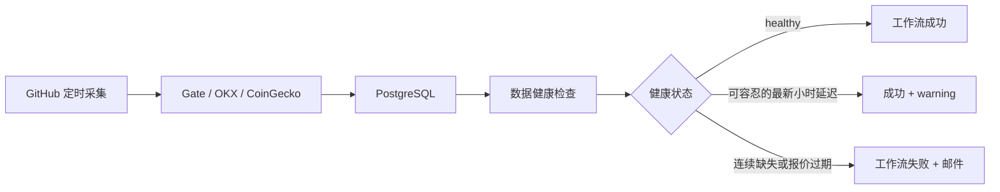

# 13 数据采集与健康告警修复任务书

> 版本：1.0
> 制定日期：2026-08-10
> 适用项目：`sitabanubanu/crypto-sector-board`
> 当前基线：`3f73228`（`origin/main`）
> 任务性质：P0/P1 数据可靠性与 GitHub Actions 告警修复
> 当前状态：仅完成诊断和任务设计，尚未修改代码、工作流、数据库或云端资源

---

## 1. 任务目标

### 1.1 总目标

修复 GitHub Actions 持续发送 `Data Health` 失败邮件的问题，同时保证告警仍然能够发现真正的数据中断。修复完成后，系统需要做到：

1. 正常的整点数据落后不再产生误报；
2. GitHub 定时采集偶尔延迟或漏跑时，下一次任务可以自动补齐缺口；
3. 报价连续过期、数据库异常、provider 失败时仍然会失败并告警；
4. Vercel 只负责读取和展示，GitHub Actions 继续负责写入数据库；
5. 不引入新的付费服务，不改变现有数据源，不重写项目架构。

### 1.2 本任务不包含的内容

- 不更换 PostgreSQL、Neon、Vercel 或 GitHub；
- 不新增交易执行、下单、资金托管功能；
- 不把缺失数据伪造为 `0` 或用旧值冒充新值；
- 不删除已有 K 线、报价或 `ingestion_runs` 记录；
- 不修改 Git 历史，不执行强制 push；
- 不在未通过 Preview 验证前直接部署 Production；
- 不为了消除邮件而关闭所有失败告警。

---

## 2. 已确认的问题和根因

### 2.1 用户看到的现象

GitHub 连续发送工作流失败邮件，失败工作流显示为 `Data Health`。Vercel 页面仍然可以打开，但数据健康接口有时显示 `degraded` 或 `critical`。

### 2.2 直接证据

最近三次失败运行：

- [2026-08-10 Data Health](https://github.com/sitabanubanu/crypto-sector-board/actions/runs/31352713870)
- [2026-08-09 Data Health](https://github.com/sitabanubanu/crypto-sector-board/actions/runs/31292187594)
- [2026-08-08 Data Health](https://github.com/sitabanubanu/crypto-sector-board/actions/runs/31236657001)

三次运行的共同特征：

1. `actions/checkout` 成功；
2. `setup-node` 成功；
3. `npm ci` 成功；
4. 只有 `npm run data:health` 失败；
5. Gate、OKX、CoinGecko 的最近一次采集状态均为 `success`；
6. provider 失败、限流、服务器错误和卡死运行数均为 0；
7. 24 小时窗口固定缺少 106 条 K 线；
8. 106 条对应 Gate 的 54 个映射和 OKX 的 52 个映射，说明是同一个小时桶整体缺失，而不是随机资产损坏；
9. 三次检查时，资产最新 K 线都停留在当天 `01:00 UTC`。

当前线上接口在检查时还发现：最近一次采集约为 `02:22 UTC`，162 个报价全部超过新鲜度阈值。这说明当前不仅有健康检查误报，还有定时采集没有及时补上的真实数据延迟。

### 2.3 根因分类

主分类为 `Configuration`，置信度为 `High`。

具体根因如下：

| 层面 | 当前问题 | 结果 |
|---|---|---|
| 采集调度 | `Market Data Ingestion` 每小时的 scheduled event 可能延迟或漏跑 | 数据库没有及时写入新一小时数据 |
| 健康调度 | `Data Health` 每天固定执行，但实际执行时间会被 GitHub 调度器推迟 | 健康检查可能在采集补偿之前运行 |
| 时间窗口 | 健康检查把当前完整小时直接纳入覆盖率 | 最新小时尚未落库就被判定为缺失 |
| 告警退出 | `report.status !== "healthy"` 时设置退出码 1 | GitHub 将工作流标记为失败并发邮件 |
| 平台因素 | GitHub scheduled event 可能延迟或丢弃；8 月 6–7 日还发生过 Actions 事故 | 放大了上述时序问题，但不是唯一根因 |

GitHub 官方文档明确说明，Actions 的 `schedule` 事件在高负载时可能延迟或丢失，建议避开整点高峰。[GitHub 工作流排错文档](https://docs.github.com/en/actions/how-tos/troubleshoot-workflows)

---

## 3. 目标运行模型

修复后的数据流应当是：



核心原则：

1. 采集任务负责写入和补洞；
2. 健康任务负责判断，不负责伪造数据；
3. 对 K 线允许一个明确、可解释的整点延迟容忍；
4. 对报价新鲜度使用独立阈值，不因 K 线容忍而隐藏报价中断；
5. 真实故障必须仍然使工作流失败。

---

## 4. 分阶段执行计划

## P0-A：恢复当前数据

### 目标

先把当前数据库恢复到可观测状态，避免在旧数据上修改规则。

### 操作任务

1. 只读确认当前 `main` 分支和工作流状态；
2. 手动触发一次 `Market Data Ingestion`；
3. 等待采集任务完成，不同时触发多个手动任务；
4. 运行一次 `Data Health`；
5. 访问线上 `/api/v1/data-health`；
6. 记录采集前后 `latestCandleAt`、`freshnessRatio`、`staleAssets` 和最近一次 `ingestion_runs`。

### 允许的外部操作

这一步会写入现有数据库并消耗 GitHub Actions 运行额度。执行前必须确认：

- 使用的是 Preview 还是 Production 数据库；
- `INGEST_DATABASE_URL` 和 `COINGECKO_API_KEY` 已配置；
- 不在日志中输出任何 secret；
- 不进行数据库删除或重建。

### P0-A 验收

- 最近一次 ingestion 为 `success` 或明确可解释的 `partial`；
- 报价 `freshnessRatio > 0.95`；
- 24 小时 K 线缺口明显减少或消失；
- `/api/v1/data-health` 不再为 `critical`；
- 如果仍失败，保留日志并停止后续部署，不用“放宽阈值”掩盖问题。

---

## P0-B：提高采集调度可靠性

### 修改范围

主要文件：

- `.github/workflows/ingest.yml`
- 必要时新增 `.github/workflows/ingest-reconcile.yml`

### 推荐方案

采用“主调度 + 低成本补偿调度”方案：

1. 将主 cron 从 `7 * * * *` 调整到 `17 * * * *`，避开每小时刚开始时的 GitHub 调度高峰；
2. 如果观察到仍有漏跑，在同一 workflow 增加 `47 * * * *` 补偿调度；
3. 两个调度共享 `market-data-ingestion` concurrency group；
4. 保持 `cancel-in-progress: false`，让补偿任务不会取消正在写入的任务；
5. 继续使用现有数据库 dedupe key，避免同一小时重复写入；
6. 继续保留 `repairLookbackHours=24`，让后续运行自动修复最近 24 小时的内部缺口；
7. 不增加新的 API provider，不增加新的数据库表。

### 失败重试

在 workflow 层增加有限重试：

- 可重试：网络超时、429、5xx、runner 临时错误；
- 不可重试：数据库 schema 错误、缺少 secret、代码类型错误；
- 最大重试次数：2 次；
- 每次重试之间等待 5–10 分钟；
- 最终仍失败时必须退出非零状态并保留摘要。

### 防重复要求

每次补偿调度必须满足：

- 不重复插入 `(asset_id, provider, timeframe, open_time)`；
- 不重复创建同一 provider、task、bucket 的运行记录；
- 已完成的 bucket 返回 `skipped_duplicate`；
- 失败或超时的 bucket 可以被下一次安全接管。

### P0-B 验收

- 连续观察 24–48 小时，采集任务之间没有超过 90 分钟的空档；
- 至少模拟一次漏跑后的补采，确认下一次运行能补齐；
- 不出现重复 K 线；
- provider 频率没有明显升高到触发限流；
- Actions 日志不包含 secret。

---

## P0-C：调整健康检查调度

### 修改范围

- `.github/workflows/data-health.yml`

### 调整内容

1. 将健康检查从 `01:37 UTC` 移到采集补偿已经有机会执行之后，例如 `05:23 UTC`；
2. 保留 `workflow_dispatch`，便于故障恢复和人工验证；
3. 在执行健康脚本前增加一次依赖状态检查，但不把健康检查改造成无条件成功；
4. 对健康脚本增加最多两次重试，每次间隔 10 分钟；
5. 重试后仍为 `critical` 或真实 `degraded` 时，必须退出 1；
6. 在 Actions Summary 中输出生成时间、最新采集时间、K 线延迟和报价延迟。

### 注意事项

调整时间只能降低时序冲突，不能保证 GitHub 永远准时执行。因此 P0-C 必须和 P0-B 一起做，不能只改 cron 后就认为问题解决。

### P0-C 验收

- 健康任务可以在采集补偿后读取到新数据；
- 单个最新小时尚未落库时不会立即发失败邮件；
- 连续数据过期时仍然会发邮件；
- 手动 `workflow_dispatch` 可正常运行。

---

## P1-A：修正 K 线覆盖窗口

### 修改范围

- `lib/ingestion/data-health.ts`

### 设计要求

目前健康检查使用当前 UTC 整点作为覆盖窗口结束点。应拆分为两个概念：

1. `coverageHourEnd`：用于 K 线覆盖统计，默认向前留出一个完整小时的容忍窗口；
2. `now`：用于报价新鲜度、provider 成功时间和运行卡死判断。

建议规则：

- K 线覆盖统计默认允许最新一个完整小时延迟；
- 报价新鲜度继续使用当前时间；
- 连续缺失两个小时不能被容忍窗口隐藏；
- 报告输出实际使用的 `coverageHourEnd`，避免运维误解。

### 预期行为

| 数据状态 | 预期结果 |
|---|---|
| 只缺最新一个可能尚未落库的小时，报价新鲜 | `healthy` 或 warning |
| K 线连续缺两个小时 | `degraded` |
| 报价超过 2 小时未更新 | `critical` |
| provider 最近运行失败 | `degraded` 或 `critical` |
| 数据库查询失败 | 工作流失败 |

### 防止误判的新增字段

建议在 `DataHealthReport` 增加：

- `coverageAsOf`；
- `latestCandleAt`；
- `candleLagHours`；
- `quoteLagMinutes`；
- `missingBucketCount`；
- `warningReasons`。

这些字段只用于解释状态，不得用默认值掩盖缺失数据。

---

## P1-B：整理退出码和告警策略

### 修改范围

- `scripts/data-health.ts`
- `.github/workflows/data-health.yml`

### 推荐策略

暂时保留非健康状态的失败机制，但明确区分：

- `healthy`：退出 0；
- 只存在最新小时延迟：退出 0，写 warning；
- `degraded`：经过重试后仍存在真实缺口，退出 1；
- `critical`：立即退出 1。

不建议第一步就把所有 `degraded` 改成退出 0，因为这会让真实 provider 失败无法被 GitHub 邮件发现。

### 后续可选优化

如果 P1 修复后仍有偶发平台延迟，可以在 P2 增加“连续两次失败才升级邮件”的策略，但必须保留健康接口和 Actions Summary 中的每次 warning。

---

## P1-C：补充回归测试

### 测试文件

建议新增：

- `tests/data-health.test.ts`

并扩展：

- `tests/ingestion.test.ts`

### 必测场景

#### 健康窗口

1. 最新一个小时缺失但报价新鲜：不应判定为 critical；
2. 连续两个小时缺失：应判定为 degraded；
3. 7 天窗口存在同一缺口：数量和比例计算正确；
4. `staleAssets` 的缺失小时数与映射数量一致；
5. Gate 和 OKX 的同一小时同时缺失时不会重复计算错误。

#### 报价新鲜度

1. 报价全部新鲜；
2. 报价部分过期；
3. 报价全部超过 2 小时；
4. provider 最近运行成功但报价本身过期，仍然能判定报价问题。

#### 采集补洞

1. 尾部缺口可以从最后一个 cursor 继续采集；
2. 内部 24 小时缺口可以被修复；
3. 重复调度不会重复插入；
4. 单个资产失败不会阻断其他资产；
5. provider 全部失败时运行记录状态正确。

### 本地质量命令

```bash
npm run lint
npm run typecheck
npm test
npm run db:check
npm run build
npm run check
```

---

## P2：可观测性、发布和观察

### P2-A：Actions 可观测性

在两个 workflow 的 Summary 中输出：

- workflow 生成时间；
- 数据库最近一次 ingestion 时间；
- 每个 provider 的最后成功时间；
- 最新 K 线时间；
- 最新报价时间；
- 覆盖率和缺失桶数量；
- 是否发生重试；
- 最终判定原因。

### P2-B：GitHub 发布

按小提交发布，建议提交顺序：

1. `fix: improve ingestion schedule resilience`；
2. `fix: align candle health window with closed buckets`；
3. `test: cover ingestion gap and health alert regressions`；
4. `docs: add data pipeline repair taskbook`。

每次提交都要：

- 查看 `git diff`；
- 确认没有 `.env`、数据库 URL、API key 或本地输出目录；
- 运行对应的最小测试；
- 不使用 `git reset --hard` 或强制 push。

### P2-C：Vercel Preview 验证

GitHub Quality 成功后：

1. 让 GitHub push 自动生成 Vercel Preview；
2. 检查页面是否可以打开；
3. 检查 `/api/v1/data-health`；
4. 检查数据时间是否前进；
5. 检查浏览器控制台和 Network 是否有新的错误；
6. 确认 Preview 使用的是正确数据库，不误连本地或旧数据库。

### P2-D：Production 发布

只有满足以下条件才能部署 Production：

- `npm run check` 全部通过；
- GitHub Quality 成功；
- Preview 页面和健康接口正常；
- 至少一次手动补采成功；
- 24 小时观察期间没有新的误报；
- 数据库连接和 provider secret 已确认；
- 用户确认可以产生一次云端写入和 Vercel 发布。

---

## 5. 任务清单和责任边界

| 编号 | 任务 | 优先级 | 目标文件/资源 | 完成标志 |
|---|---|---:|---|---|
| T-001 | 记录当前工作流、线上接口和数据库健康基线 | P0 | GitHub/Vercel/DB | 有可比较的基线记录 |
| T-002 | 手动补采缺失数据 | P0 | GitHub Actions/DB | 最新报价和 K 线恢复 |
| T-003 | 调整 ingestion cron | P0 | `.github/workflows/ingest.yml` | 采集不再集中在整点高峰 |
| T-004 | 增加补偿调度或有限重试 | P0 | ingestion workflow | 漏跑后可自动补洞 |
| T-005 | 延后 data-health 调度 | P0 | `.github/workflows/data-health.yml` | 健康检查不抢在采集之前 |
| T-006 | 健康检查增加最新小时容忍 | P1 | `lib/ingestion/data-health.ts` | 单小时延迟不误报 |
| T-007 | 保留真实 stale quote 告警 | P1 | `lib/ingestion/data-health.ts` | 2 小时无报价仍 critical |
| T-008 | 增加健康报告解释字段 | P1 | `lib/ingestion/data-health.ts` | 能显示 lag 和缺口原因 |
| T-009 | 增加覆盖率和补洞测试 | P1 | `tests/*.test.ts` | 回归测试覆盖关键场景 |
| T-010 | Actions Summary 输出诊断信息 | P2 | 两个 workflow | 失败无需下载长日志 |
| T-011 | Preview 验证 | P2 | Vercel Preview | 页面、API、数据正常 |
| T-012 | Production 发布和 24 小时观察 | P2 | Vercel/GitHub | 无误报且真实故障可告警 |

---

## 6. 验收标准

### 数据新鲜度

- 正常情况下，报价最新时间距当前时间不超过 2 小时；
- 采集任务连续两次之间不超过 90 分钟；
- 缺失单个最新小时时，系统会显示 warning 而不是错误地报 critical；
- 连续缺失两个小时或报价过期时，系统会报 degraded/critical。

### 告警准确性

- 连续 24 小时不因单个整点延迟发送误报邮件；
- provider 失败、数据库失败、secret 缺失仍然会让工作流失败；
- 邮件内容或 Actions Summary 能说明是报价过期、K 线缺口、provider 失败还是数据库错误。

### 数据完整性

- 不产生重复 K 线；
- 不删除已有历史数据；
- 重试和补偿任务可以安全重复执行；
- 失败资产不会覆盖成零值；
- 旧数据不会被伪装成当前数据。

### 发布质量

- `npm run check` 通过；
- GitHub Quality 通过；
- Vercel Preview 构建成功；
- Production 健康接口可访问；
- 24 小时观察期内没有新的同类误报。

---

## 7. 风险、控制和回滚

### 风险 1：补偿调度造成 provider 限流

控制措施：

- 先只增加一次补偿调度；
- 保留现有 adapter 的限速和重试策略；
- 观察 24–48 小时的 429 和 5xx 数量；
- 如果限流上升，先移除补偿调度，不改 provider 逻辑。

### 风险 2：健康窗口过宽，隐藏真实缺口

控制措施：

- 容忍窗口最多一个小时；
- 报价 freshness 独立判定；
- 连续缺失两个小时仍必须失败；
- 新增 `candleLagHours` 和 `missingBucketCount`，不允许静默降级。

### 风险 3：workflow 重试导致并发写入

控制措施：

- 保持 concurrency group；
- 不使用 `cancel-in-progress: true` 取消写入任务；
- 依赖 ingestion dedupe key 和数据库唯一索引；
- 对 running 超时任务使用现有安全接管逻辑。

### 回滚方案

1. 如果仅 workflow 调度有问题，回滚 workflow 文件提交；
2. 如果健康窗口逻辑有问题，回滚健康逻辑提交；
3. 数据库已写入的正确数据无需删除；
4. 回滚后手动运行一次健康检查；
5. 确认回滚不会重新引入 secret 或旧 JSON 写入路径。

---

## 8. 执行门禁

### Gate 0：开始前

- 明确当前使用的数据库环境；
- 记录 GitHub run ID、Vercel deployment URL 和健康报告；
- 确认工作区没有需要覆盖的用户改动；
- 确认不修改任何 secret。

### Gate 1：P0 完成后

- 当前数据恢复；
- 采集任务可以补洞；
- 健康检查不再因为一个最新小时延迟误报；
- 真实报价过期仍能报警。

### Gate 2：Preview 发布前

- 代码、类型、单元测试、构建全部通过；
- workflow YAML 修改已在 GitHub 实际运行中验证；
- Preview 使用正确数据库。

### Gate 3：Production 发布前

- Preview 至少观察一个完整采集周期；
- 没有新的重复写入或 provider 限流；
- 用户确认执行云端发布和数据库写入。

---

## 9. 成本和权限说明

本方案默认继续使用：

- GitHub Actions；
- 现有 PostgreSQL；
- 现有 Vercel；
- 现有 Gate、OKX、CoinGecko 数据源。

不新增付费监控、第三方 Cron 或消息服务。增加补偿调度会增加少量 GitHub Actions 运行次数；公开仓库通常不会产生新的托管费用，但仍应观察 Actions 使用量和 provider 限流。

需要用户明确确认的操作：

- 手动触发云端采集；
- 写入 Preview 或 Production 数据库；
- 推送 GitHub；
- 部署 Vercel Production。

---

## 10. Definition of Done

只有同时满足以下条件，任务才算完成：

1. 当前数据库缺口已恢复或有明确的 provider 级失败说明；
2. ingestion workflow 能在定时延迟或一次漏跑后自动补洞；
3. data-health 不再把单个正常整点延迟当成故障；
4. 报价超过两小时未更新仍会产生 `critical` 告警；
5. 测试和完整质量检查通过；
6. GitHub Quality 通过；
7. Vercel Preview 验证通过；
8. Production 发布后至少观察 24 小时；
9. GitHub README 和运行文档已同步说明新的采集/健康规则；
10. 没有暴露 secret、删除数据或引入未授权付费资源。

---

## 11. 推荐执行顺序

```text
T-001 基线记录
  -> T-002 手动补采
  -> T-003/T-004 调整采集调度和补偿
  -> T-005 延后健康检查并增加有限重试
  -> T-006/T-007 修正健康判定
  -> T-008/T-009 增加诊断字段和回归测试
  -> npm run check
  -> GitHub Quality
  -> Vercel Preview
  -> 24 小时观察
  -> Production 发布
```

本任务书完成的是设计和执行边界；在用户确认开始执行前，不应触发云端工作流、修改数据库或部署 Production。
